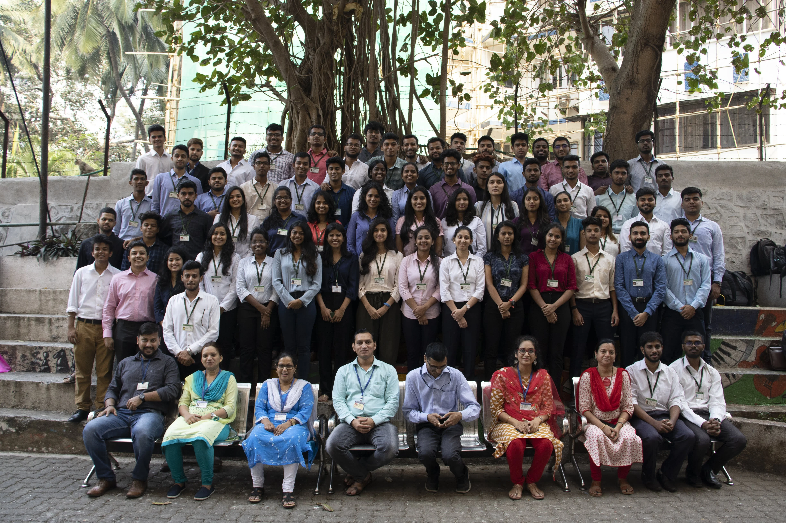

Like any other CRCE student, my journey towards the college began with the immortal words of "Tation Tation Tation". Just like you, I too was in the dilemma of whether I should opt for the overpriced rickshaw or the overcrowded bus. I guess one point that we all could agree upon is the college has this magnificent view. After all, most of us took admission in the college for this very spectacular view. I, for one, could sit down for hours and hours gazing across that beautiful sea towards the Mumbai skyline right beside that sea link. You have no idea how many nights I've spent in the college to enjoy this breathtaking view, but we are getting ahead of ourselves in the story.

You start off with the first year, unsure of what you want to do? Unsure of what is expected of you? You struggle through the first day and find out you aren't alone. You find out that there are others just like you who too have faced the same issues and just like that you form your first set of friends. Days go by, and you along with your new friends, decide that the circle need not be restricted to just your class. You choose to branch out. Slowly days turn to weeks, and you get pushed into the exam mode. If only the fear of IIT entrances and CET hadn't done enough damage to you. You keep hearing these "facts'' of KTs and backlogs. You decide to power through hoping to do better. Every student starts off their first semester preparation by aiming for a ten pointer; it's in the later years when you realize that the pointer merely matters with regards to the future of your life. Vivas come on the docket, and everyone is busy rotting every inch of techmax that they can lay their eyes on. Each session is filled with asking every person who leaves the room "kya pucha kya pucha?" No matter what happens, the beautiful thing about friendship is since it's your first viva it will always end up with you and your gang taking pictures in your first formal outfits. And just like that innocently a tradition is born. Finally, you get the time table and here starts the “Kal se pakka padhunga” and countless hours spent on deciding the muhurat for you to start studying. Despite all your efforts, “Asli padhai toh last ke 1 ghante mein doston ke saath milke hoti hai because bhai ye bohot important hai pakka aayega” is your life for 8 semesters.

The next few years will just go flying by. You wouldn't even know it, and you'd be living through some of the best days of your life. You and your friends will be scattered amongst various councils, teams and clubs. They get busy with their own schedules, and so do you. Everyone is busy making their lives better. In some cases, it is the race to fill up that resume, and in some cases, it's the race to fulfil their dreams, but no matter what's your fuel you always find some time to meet up with friends. We the students' of CRCE are so lucky to have the bay right in front of us. Despite the public opinion, that is one of the places where most of the memories have been created. I can bet there would've been at least one day where you stood there right in the middle of the streets lost in the beauty of the sky and the view that you see from there. I guess that is why our college stands apart from the others. Even though it moulds you to be a better individual, it also keeps you in check by showing you the beauty of the world around you.

The fact of the matter is once you get into this stream of engineering you'd get used to all this. You'd get used to the long hours, the assignments, the pressure, the jokes you'd get used to all of it. What you won't get used to is this beautiful life that you live in the confines of our college. Each and every day that you walk up, and down that slope, a part of you will realize that this is momentary that this isn't going to last for your lifetime. What will last is what you make of it. No matter what happens, no matter where you end up, some memory fragment of the college will linger behind in the back of your mind. Now it doesn't really matter whether it's the echoes of Production through the halls of the college or the cheers of IT during the fests. It doesn't matter whether it's the events attended at Samvaad or the tireless days you put into Euphoria. What matters is wherever you go, wherever you end up there will always be a smile on your face when they ask hey are you from CRCE?
