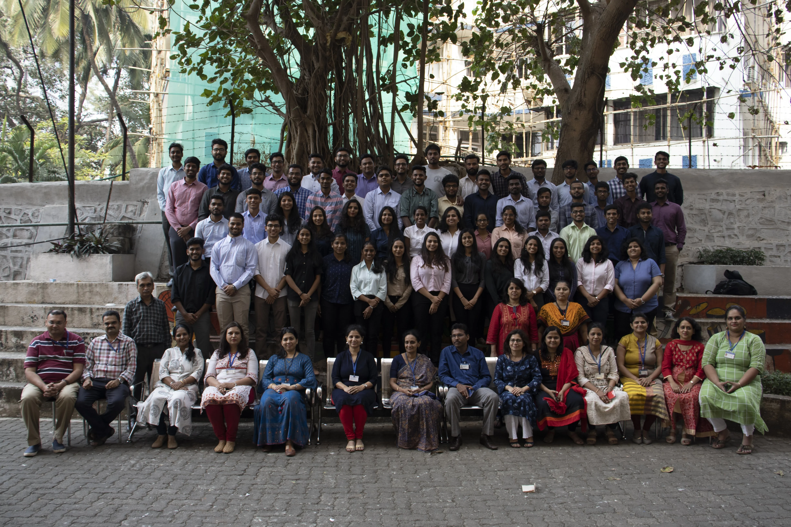

I blame this millennial movie culture that puts you under this belief that the universe will catalyze its actions for you to have your young, beautiful and juvenile years of college excelling at all the opportunities, and a hobby you mastered in, you’ll make a “squad” that’ll last a lifetime, ragers will be above attendance or assignments, you somehow end up better looking, “Yeh Dosti Hum Nahi Chodenge” plays in the background during your entire last semester and life is a Utopia at the end of 4 years. From where I stand today, one thing I believe in is, life might never be a Karan Johar movie.

Sometimes, we spend so much time fixating over the beginning and the end of a moment or a phase, that we tend to inexplicitly ignore the journey and the worst-case scenarios that come underway – something a privileged 17-year-old me is guilty of. I wouldn’t have realized sooner that living my entire life with everything and everyone I need in a 5 min away radius is an inhibitor in itself.

It all started with a simple Barbie I would love to break apart and join again, Microsoft Paint and Word Art that brought out the digital artist in me and of course, the internet that made me feel like an intellectual when I read about algorithms and Mark Zuckerberg becoming the youngest billionaire. You see, Engineering is something I always wanted to do, which is why when I came to Fr. CRCE – I was content and expected from this universal alchemist of my journey to take care of the course in accordance to the catalysts I held - hard work, ability to prioritize and a knack for being a social bee.

I once read “Make as many mistakes you can while you’re young” – pretentious self-appreciated the depth to it and passed it on as another clique. You see, I was oblivious to it pitching up in the past few weeks – not very aberrant for a student in their final semester trying to contemplate life one last time. And Oh! I have a bit of skill towards understanding it. I have made my fair share of mistakes, and I carry heavy luggage of failures. I remember being an FE kid; most people from the batch failed to understand. Though an extremely novel experience, materialistic or social acceptance has never bothered me. However, for a very long time, I didn't see any "Yeh Dosti" happening. My hard work helped me reach places I always anticipated to belong – Dramatics Club, Debate Society, technical councils, a technical team, on the maps of seniors for the right counselling. Perhaps, I never anticipated all hell breaking loose when I was at the end of rejection, academic decline, being fired, wrong decisions, being insincere, losing perspective and going through it all alone for a very long time. You could see me calling CRCE one of the biggest omens of my life and blaming the feng shui for it. You know, it takes a toll on someone who was raised in a family of aggressive career paths who taught them to choose ambition over one’s desires. But perhaps, it also makes me someone who is irrevocably in love with her dreams.

After being stripped down of my “social bee” and “the smart kid” apprehension, even though it felt like I have lost everything, it was only the true love of my life – my dreams – that made me hold on to the grain of faith and confidence I had left in myself. Never to forget, I could only hold onto my identity because of the support of my family and a few angels in disguise I made friends with along the way. You see, a lot of things are put into perspective only when you’re at your lowest. You find gratification in your origins and perceive the role of every person who shaped your teenage stubborn but clay-like personality. Plenty of mistakes were made, including the three times I boarded Borivali Fast instead of Churchgate to get to college. I went around everywhere seeking guidance, wisdom, sincerity and growth. I might not be an ideal senior one would go for academic excellence, but I think I’ve reached a point where it’s safe to contemplate if I can start consultancy services for budding engineers. My goals have never been as vivid, I have never been braver, hope is stronger than ever, and mistakes were plenty made to know what not to do. But most importantly, I found trust, wisdom and faith in myself. I know I can be vulnerable but invincible, powerless but impregnable. I mean, if my clumsy, careless self can learn to travel in the Mumbai locals evolve to have my term work submitted on time, I can definitely do anything else, right?

Here I am, another student in their final semester, in the original paradigm of trying to contemplate and make sense out of the four years, and all I see it boil down to is – I am happy. Life may not be the perfect Karan Johar movie, I may not have excelled at all the opportunities, but each one gave me a lesson I will hold onto for a very long time. I may not have mastered in the hobbies I am interested in, but I indeed found new ones that make me a livelier person every day. The ball and chain of attendance never stopped us to prioritize Euphoria over everything else. I may not hear "Yeh Dosti Hum Nahi Chodenge", but I certainly do hear all the OHOs to “Jinne Mera Dil Luteya”.

Such was my CRCE journey. Yes, I feel blessed for four years of perhaps not pleasure but a sheer privilege. I feel blessed to be a part of someone else's progress. I feel blessed to discern this army of invincible CRCE created. My climb through this slope hasn't been an easy one (figuratively and literally). I feel blessed to have survived it by restoring faith in the alchemist – my true original self, and a lot of support from the catalysts – Paplus (you know who you are). In the end, it was all worth reaching the top and uploading Instagram stories of the Bandra Worli Sea Link. Thank You CRCE for making me invincible – Aapki yaad hamesha aaegi.
