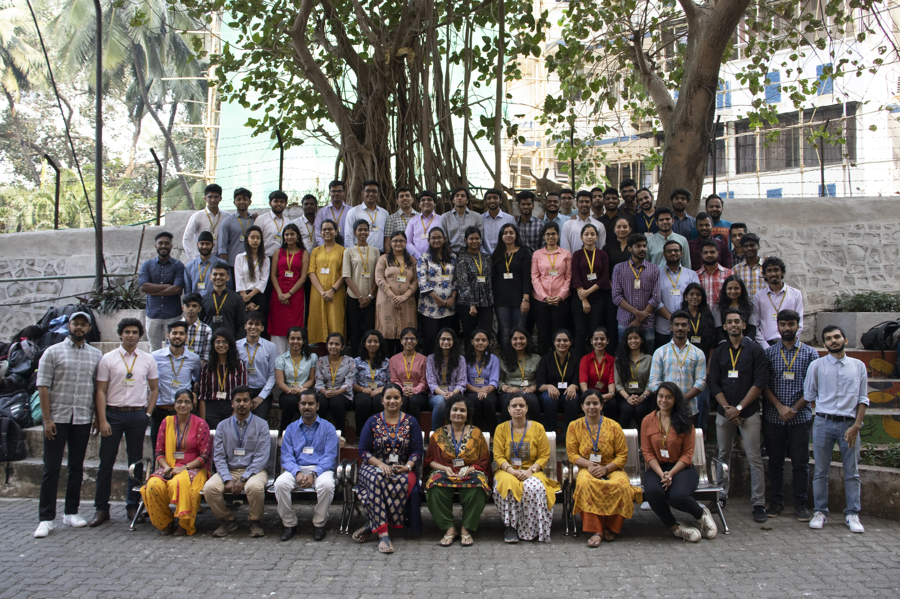

Well in retrospect, I feel that the last four years have been nothing but a roller coaster ride with no seat belts and the reason I say so is the people of my class, my fellow comrades. I mean never have I ever in my life witnessed such a parade of soldiers where each one of us belonged to a different creed, ideology, temperament and work ethic. Being diverse in so many ways yet united we stood whenever “WE” were questioned. I do remember the very first day of college when I came to confirm my admission. It was one of those gloomy July days when you scarcely see the sun and worsening it the rain was really bucketing down but little did I know the coming days, months and years were going to be a rainbow of 74 vivid colours and each one of them leaving a profound stroke on my canvas. Initially, it did take a while to fathom everyone especially the frontbenchers who didn’t speak much but with the dawn of our very first euphoria even the introverts transcended into extroverts, where everyone had a notion and opinion wanting to contribute in some way. I remember how fervently everyone waited back till midnight ornamenting the entire floor with Egyptian mummies and Pharaoh. Although we didn’t win, it didn’t lead our spirit down; Next year we promised to come back tougher and we did. I remember my friend Anish and I conversing about a script just a night before our DSA paper which might help us win “We are the world” competition and when the time came we approached our class with the notion and how I would love to play the protagonist; They graciously consented and that is something I’ll always be grateful and indebted for. We did complete the film but on contrary to my conviction we didn’t win any award. However, there was a surreal reaction by the crowd. I remember the crowd cheering and whistling after the movie and also receiving my very first compliment from a senior that I acted well and when I asked her did she like the movie she smiled back and said, “I didn’t see it entirely but yaa everyone’s talking about it” her words really drenched my heart with joy and aspiration and will always remain with me in the very core of my heart. Also that year something astonishing happened and all our efforts were fruitful as we won the 3rd position in the dance competition and became the only SE class in the top three. I remember running down in the auditorium screaming my lungs out affirming IT IT! That small win boosted our morale up and made us believe that we too can do it. Then next year with all our hopes high we participated again. Well, this time too my class came with a beautiful concept of religious equality and somehow managed to put an extraterrestrial character “PK” into the act. To my surprise they approached me to play the part and I was quite overwhelmed with joy. Although now when I look back maybe it was something to do with the way my face looked? Anyways, Coming back to the event we did lose awfully and all our hopes were shattered. That day after the results no one spoke much, everyone left for their homes quietly without much interaction and also there was some kind of languor in the air that night. Well, maybe it was the calm before the storm. It’s funny how we don’t value time much cause it passes rather quickly than how we think it does. Without realizing much we were in our final year and after three consecutive losses our dream looked even bigger and mammoth. Deep down we all knew there’s no way around. In the last three years we have faced a lot of ridicule and rebuke and the only jarring way to answer back was a victory. We were so eager to win that we ended up rejecting two choreographers and finally making peace with the third. Although convincing us was quite a task cause we weren’t ready to settle for less. Even while practicing there was extreme self-doubt and disapprobation just to please our sole motive of surpassing and outshining everyone. Winning small events during the fest acted as a boon to our confidence and we were on a tremendous victory run until the sports day. I wasn’t present then but I remember calling my friend and asking whether we won the girl’s sports trophy as we were leading in points with a good margin to which he replied with a no and added that the girls were remorseful and heartbroken after the loss. That day solely changed our approach towards the competition and acted as gasoline to fire. People started waiting back and putting in that extra push and soon the day arrived. I remember we were still creating props just a few hours before the fashion show and implementing new ideas just to be superior to others. Our choreographer acted as a guardian angel who accepted willingly to help us just a day before the event and was teaching us new formations an hour prior to the act. I must say we were less rehearsed but maybe the cosmic ruler saw our efforts and zeal for triumph and was generous to us. The show did go well although the results were supposed to be announced the next day which was also the culmination of our dream. We went back home with fear and agitation. I’m quite sure no one slept well that night. The next morning the day had come, the judgment day. We circled up before our performance prayed to almighty, wished our self luck and shouted out loud IT! And when the curtains furled aside there was a huge crowd right in front of us; At that very moment we knew we were there to win and turn every ridicule into an applaud. Fourteen minutes later when we finished our performance we saw something we always craved for a full house standing ovation with just two alphabets on everyone’s lips IT. In spite of such a response we were still very perturbed about the results and then the results were announced. Well, they said we won. What followed right after the announcement? I personally don’t remember much cause there was a lot happening. We all were so boisterous that we reacted in different ways; some were jumping, some crying in bliss and some even running around the stage like animals and why not the dream we pursued for four years was standing right in front of us affirming that every inch of those trophies belonged to us. I had never ever in my life seen humans smile so wide before, well maybe that’s the reason they call it euphoria. At the end of the day we walked out of the auditorium with the best fashion show trophy, the best dance trophy and the cultural trophy in our hands and few tears in our eyes. Yes, we indeed did it!
