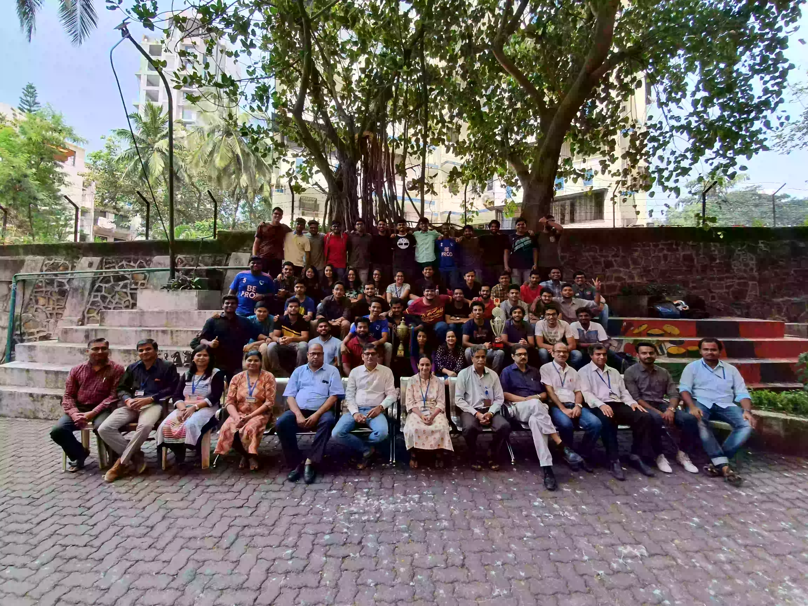

“College will be the best 4 years of your life”, hasn’t everyone heard this phrase at least once before entering this phase of their lives? So did I, but I often wondered why is it believed to be so? What special does it have? Is it college specific? Today, when I write this article, my heart feels heavy, because I now know the answer to these questions, I am indeed on the other-side of the 4 years.

15th July, 2016, I was at home preparing to go to SRM, Chennai. I had a flight on 17th. When my dad called and said, “I am sending Munshiji (my driver), just come where he gets you.” I had no idea what was going on. I was being virtually kidnapped. So I just got ready and left. And here I was at Fr. Conceicao Rodrigues College of Engineering, staring at my dad signing a cheque. So this was my Introduction to the place where I was going to spend my “4 most precious years” of my life. I was in awe of the location (obviously). But there was something more, there was a very unusual feeling of belonging I had there. Everything just felt right.

On the 1st of August, a very happy, overexcited and energetic boy (ME), was standing in front of a huge slope. Absolutely ready to run up. That is when something hit me and I just felt absolutely calm, still with a lot of energy though, and thought to myself, “Something great is going to happen here, I want to make a mark in whatever way I can, and this place is going to help me do that.” So I just rushed up the slope and the stairs, to the 5th floor, and entered a room full of new faces, some scared, some happy and some absolutely indifferent. This sight in itself was so fascinating to me that I found myself walking with a huge smile, looking into space. So, this was it, a journey had begun, which looked long from that end, and how I wished it were.

I was talking to random people and enjoying with them. Having an absolute bliss. Things keep getting better, seniors knew me, teachers knew me and suddenly was getting a lot of attention. But one thing bothered me, I always felt I owe this attention to them because I had personally done nothing to get all of it. I owed it to my class. But everyone who knew me would tell me that my class is absolutely useless and good for nothing. I did not know how to change that. I knew the class to be a mixture of gems who could do anything they would set out to do. While all of this was going on in my head, I was made the representative of the class. I took it too personally to change the reputation of my class, and I was super lucky that all of them were willing to travel the path with me.

In the second semester we had our first fest. This was a time to show what the class actually was worth. This was discussed with the class and everyone participated in everything they could. Most of the teachers and seniors praised the class and I was very happy. I wanted this to continue and win trophies! A plan was ready as to how I would go about it and get all the trophies by 4th year.

While this was a top priority I also had to do things to add to my profile. All my seniors wanted me to be a part of their councils, but I had 4 KTs in the 1st semester and the results of the retest were not declared (I ultimately cleared them). As per rules I could not join any of the councils. I was extremely concerned about how things would shape up. This is when I got an opportunity to start a Council with my seniors, the IIIExCRCE. Suddenly my purpose of creating the council also shifted from my profile to helping students build their profiles. Make them visit industries, attend seminars and give them certificates for the same. This also added up to the list of aims for 4th year, to have a good running council, which made a mark, and we did!

Coming back to my class. These were the people helping and supporting me at all fronts. They built me into a completely different person. I made so many mistakes throughout, and they stayed along like a stick and never let me fall. From shouting at them, to laughing at lame PJs we did everything together as a team. We won all the trophies together (the journey is too long to be in this article).

I do not know how to describe these beautiful souls! If “made for each other” could have been applicable to 60, that would define my class. While I talk about the class, I cannot ignore how much my professors supported me all the time. In any situation, if I would ask them for some time to sort things out, they would just let me do whatever I wanted. This is what my college life was, receiving a lot of love and respect from my teachers and juniors. Could not have asked for more!

Since the 4th year started, it has been a very different experience. Every moment felt nostalgic and we just wanted to hold back time some more, but that is not how time works, we were standing at the end of the journey. We are as clueless as we were on our first day of college. There was only one difference. This time we had only one question, “Is it really over?” we knew the answer as well….but did not want to accept it. We all were looking for just one last moment. But just like my introduction with Fr.CRCE, destiny had different plans. A pandemic hit the world. The last thing someone would expect as an end to College Life!

Well, all I can say is that, my college journey has been a game of destiny, the most beautiful, but with a completely unprecedented start and end. I don’t know if we would ever get a farewell, so here is what I want to tell my gems, “I LOVE YOU 3000”. My best wishes, love and unlimited hugs!
